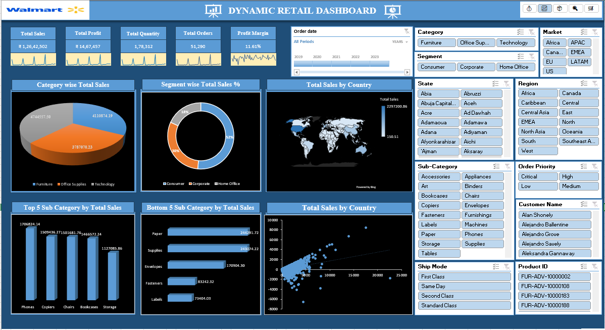

# Excel-Walmart-Dynamic-Dashboard
The Dynamic Retail Dashboard is an interactive and data-driven tool built in Excel to visualize and analyze retail data. It connects to datasets hosted on GitHub, uses Power Query for data transformation, and presents insights through dynamic charts and KPIs. The dashboard solves key business questions, enabling informed decision-making.

## Tools Used
- Microsoft Excel
- Power Query
- Pivot Tables
- Pivot Charts
- Slicers
- Conditional Formatting

## Features
- Interactive dashboard with slicers
- Dynamic KPI cards
- Sales and profit trend analysis
- Category-wise profit analysis
- Segment-wise sales share analysis
- Country-wise sales tracking
- Top-performing subcategory analysis
- Real-time filtering and drill-down
- Automated data transformation using Power Query

## Dataset Information

The project uses three datasets:

### 1. Orders Table

- Order ID
- Order Date
- Ship Date
- Customer Name
- Segment
- Country
- Market
- Sales
- Profit
- Discount

### 2. Returns Table
Contains information about returned orders and associated markets.

### 3. People Table
Contains sales representatives and their assigned regions.

## Problem Statements Solved
### 1. Key Performance Indicators (KPIs)
KPIs displayed in the dashboard include:

- Total Sales
- Total Profit
- Total Quantity
- Total Orders
- Profit Margin

### 2. Sales and Profit Trend Analysis
Analyzes sales and profit trends to identify seasonal patterns and business growth.

### 3.Category-Wise Profit Analysis
Compares profit across categories such as Furniture, Office Supplies, and Technology.

### 4. Segment-Wise Sales Share
Shows the percentage contribution of customer segments like Consumer, Corporate, and Home Office.

### 5. Sales by Country
Tracks sales performance across different countries and markets.

### 6. Top 5 Performing Subcategories
Highlights the highest-performing product subcategories based on sales.

## Dashboard Insights
- Technology category generates the highest profit.
- Consumer segment contributes the largest share of sales.
- Q4 records the highest sales and profit trends.
- Phones and Accessories are top-performing subcategories.
- United States leads in overall sales performance.

## Dashboard Screenshots

## Conclusion
This dashboard helps retail businesses monitor key metrics, identify profitable categories, track country performance, and make data-driven decisions efficiently.
